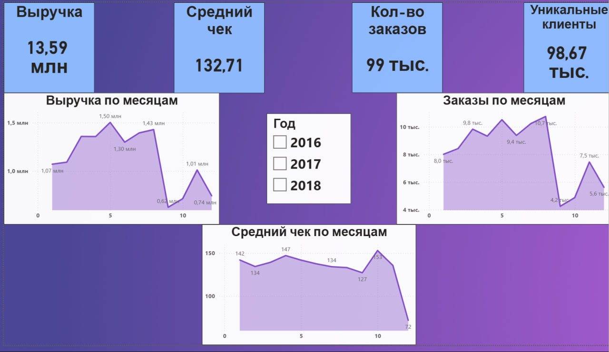
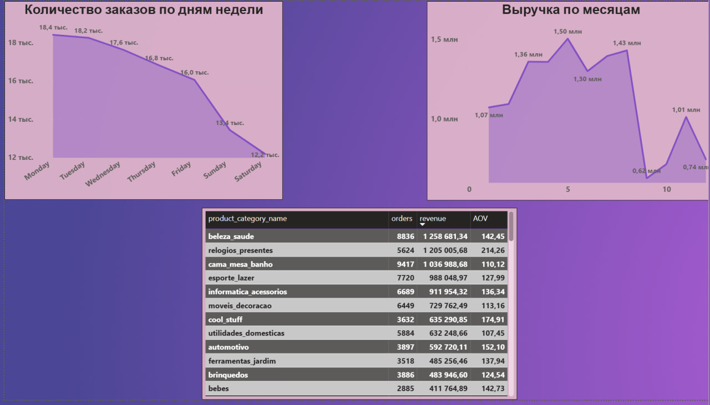
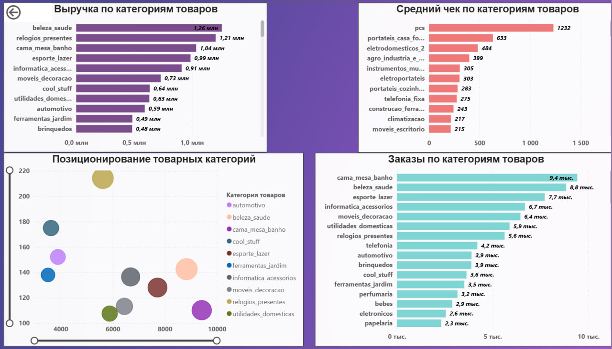
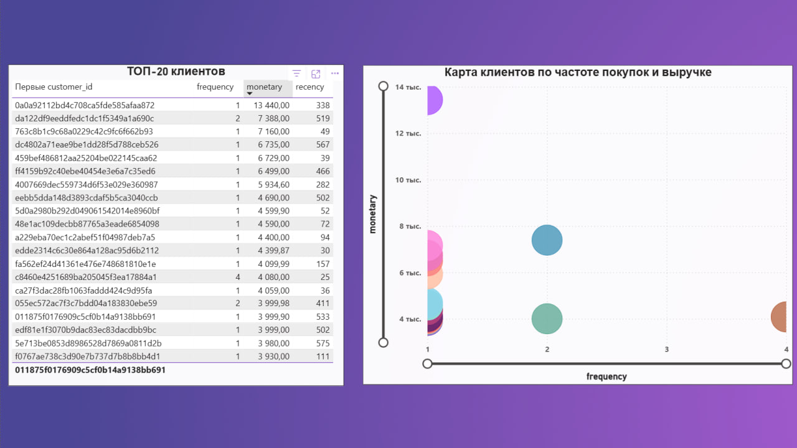
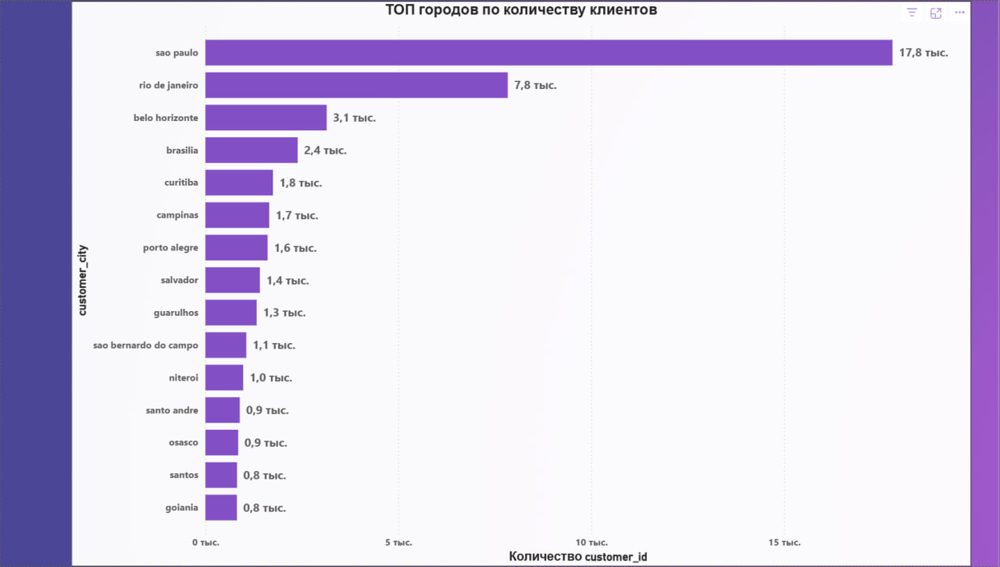

# Olist E-commerce Data Analysis (Brazil)

📌 **Русская версия README:** [README_RU.md](README_RU.md)

## 📊 Project Overview
This project analyzes the Brazilian e-commerce dataset **Olist** with the goal of understanding sales performance, customer behavior, and product trends.

The project demonstrates a full analytics pipeline:
- Data cleaning & feature engineering (Python)
- Metric calculation (AOV, GMV, Repeat Rate, RFM)
- Business-oriented dashboards (Power BI)

---

## 🧠 Business Questions
- How does revenue change over time?
- Which product categories generate the most revenue?
- What is the average order value (AOV) by month and by category?
- How many customers return for repeat purchases?
- Who are the most valuable customers?
- How are customers distributed geographically?

---

## 🛠 Tools & Technologies
- **Python** (pandas, numpy, matplotlib)
- **Power BI**
- **Jupyter Notebook**
- **GitHub**

---

## 📈 Key Metrics
- **GMV (Gross Merchandise Value)**
- **Revenue**
- **Average Order Value (AOV)**
- **Repeat Rate**
- **Orders Count**
- **RFM Segmentation (Recency, Frequency, Monetary)**

---

## 📊 Dashboard Preview

### 1️⃣ Overview

**What is shown:**
- Total revenue
- Total number of orders
- Average Order Value
- Repeat Rate

**Business insight:**  
The marketplace shows high transactional activity with a relatively moderate average order value. While repeat customers represent a meaningful share, most revenue is still generated by one-time buyers, indicating growth potential through loyalty and retention strategies.

---

### 2️⃣ Sales Trends

**What is shown:**
- Revenue by month
- Number of orders by month
- AOV dynamics over time

**Business insight:**  
Revenue and order volume exhibit clear seasonality with noticeable peaks toward the end of the year. The relatively stable AOV suggests that revenue growth is primarily driven by an increase in order volume rather than higher prices.

---

### 3️⃣ Products

**What is shown:**
- Revenue by product category
- Top products by revenue
- AOV by category

**Business insight:**  
A small number of product categories generate the majority of total revenue, reflecting a Pareto distribution. Categories with higher average order values do not always lead in total revenue, highlighting the difference between high-volume and premium segments.

---

### 4️⃣ Customers & RFM Segmentation

**What is shown:**
- Customer segmentation based on RFM metrics
- High-value and frequent customers
- Distribution of customer value

**Business insight:**  
RFM analysis identifies a small but highly valuable segment of customers who purchase frequently and contribute disproportionately to total revenue. These customers represent a key target group for retention and personalized marketing efforts.

---

### 5️⃣ Geography

**What is shown:**
- Revenue and order distribution by region/state

**Business insight:**  
Sales are concentrated in a limited number of regions, indicating uneven demand distribution. This pattern may be influenced by population density, logistics infrastructure, or regional economic factors and can support regional optimization strategies.

---

## 📁 Data Source
Public dataset: **Olist Brazilian E-commerce Dataset**

---

## 🚀 Conclusion
This project demonstrates practical data analytics skills:
- Working with real-world messy data
- Translating raw data into business insights
- Building clear and actionable dashboards

The project for a **Data Analyst / BI Analyst portfolio**.
